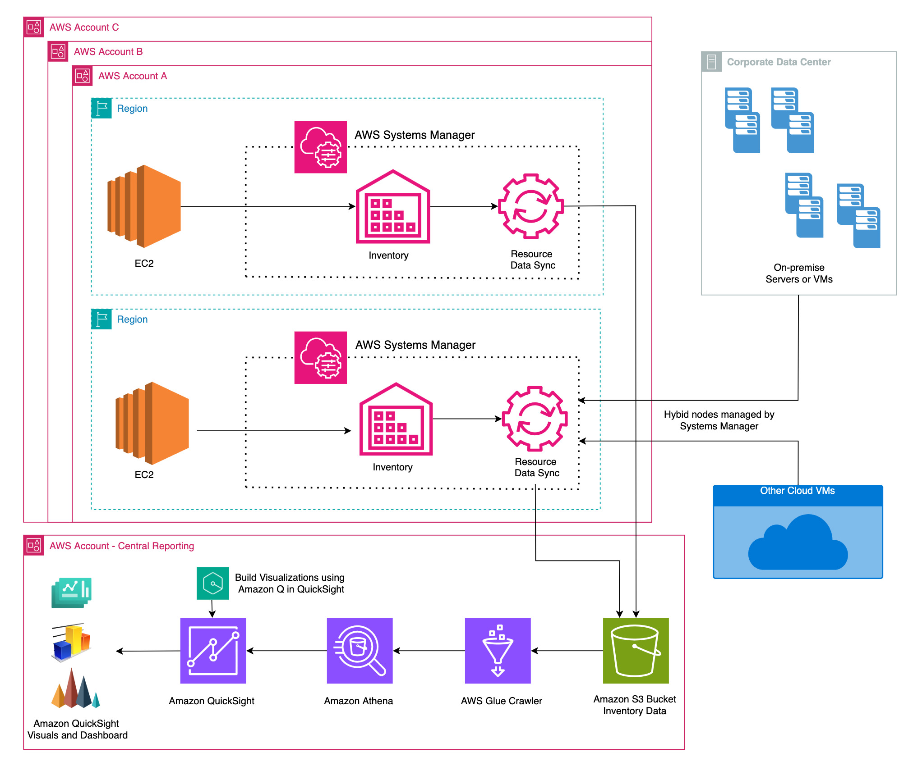

# Building enterprise patching and inventory dashboards using Amazon Q in Amazon QuickSight

## Introduction

In today's fast-paced IT environment, monitoring and visualizing patching compliance across your infrastructure is crucial. Traditionally, creating comprehensive patching dashboards in Amazon QuickSight has been a manual, time-intensive process requiring multiple steps for each visual component.

Amazon Q in QuickSight is an AI-powered assistant that enhances data analysis and visualization capabilities within Amazon QuickSight. This blog explores how Amazon Q in QuickSight transforms this experience by simplifying dashboard creation through natural language interactions. By reducing a multi-step manual process into a few simple prompts, you can quickly generate insightful patching compliance and inventory visualizations.

The solution provides comprehensive visibility into your infrastructure through custom inventory visualizations, allowing you to:

- Monitor patching compliance in near real-time
- Create dynamic dashboards with minimal effort
- Maintain accuracy in compliance reporting
- View computing resources distribution across cloud providers
- Track AWS drivers and instance types
- Better understand infrastructure distribution

## Solution Overview

The solution integrates multiple AWS services to create a comprehensive monitoring and visualization system:

### Key Components and Workflow:

1. **Data Collection:**
   - Custom script execution via AWS Systems Manager (SSM) association
   - Runs on target managed nodes every 7 days
   - Gathers required inventory information
   - Places data in custom inventory path

2. **Data Aggregation:**
   - SSM inventory collects data from various AWS accounts
   - Resource Data Sync consolidates information to central S3 bucket
   - Supports multi-account and multi-region deployment

3. **Data Processing:**
   - AWS Glue crawler processes data every 12 hours
   - Creates and maintains Glue database
   - Scheduling intervals can be modified per organizational needs

4. **Data Access and Visualization:**
   - Amazon Athena queries data from Glue database
   - QuickSight creates datasets from Athena queries
   - Amazon Q in QuickSight enables natural language visualization

### Data Collection Scope:

The solution captures comprehensive metadata including:

- Cloud provider information (AWS, on-premise VMware, etc.)
- Storage metrics (total/free disk space, usage percentages)
- Instance-specific details for EC2:
  - Hypervisor type (xen/nitro-based)
  - Instance deployment type (on-demand/spot)
  - Driver versions (NVMe, ENA)
  - Licensing information (Windows License included/BYOL)

This enhanced monitoring system provides a complete view of your infrastructure, enabling better decision-making and compliance management across your organization.

### SSM Custom Association Collects:

- Cloud_provider information
- Total_diskspace
- Free_diskspace
- Free_space_percent
- Diskspace_status
- EC2-specific information:
  - EC2_type
  - Instance_type
  - NVMe_version
  - ENA_version
  - License_type

## Prerequisites

- [Systems Manager Managed nodes](https://docs.aws.amazon.com/systems-manager/latest/userguide/managed_instances.html)
- [Systems Manager Inventory enabled](https://docs.aws.amazon.com/systems-manager/latest/userguide/systems-manager-inventory.html)
- [Systems Manager patch scan/install operation](https://docs.aws.amazon.com/systems-manager/latest/userguide/systems-manager-patch.html)
- [Amazon QuickSight user account](https://docs.aws.amazon.com/quicksight/latest/user/signing-up.html) (Admin pro or Author pro)
- Required permissions for [CloudFormation StackSets](https://docs.aws.amazon.com/AWSCloudFormation/latest/UserGuide/what-is-cfnstacksets.html)
- AWS Organization ID

## Walkthrough

### Deployment Steps

1. Download and deploy the CloudFormation template
2. Create visuals using Amazon Q in Quicksight

Refer to the blog [Building enterprise patching and inventory dashboards using Amazon Q in Amazon QuickSight](https://aws.amazon.com/blogs/mt/building-enterprise-patching-and-inventory-dashboards-using-amazon-q-in-amazon-quicksight/) for detailed deployment steps.

## Conclusion

This solution demonstrates how [Amazon Q in QuickSight](https://docs.aws.amazon.com/quicksight/latest/user/quicksight-q-in-quicksight.html) simplifies the creation of Systems Manager patching and inventory dashboards through natural language interactions, providing real-time insights into patching compliance, inventory status, and infrastructure distribution.

## Authors

- **Suhail Fouzan**: Specialist Solutions Architect at AWS
- **Rizwan Mohammed**: Senior Technical Account Manager at AWS
- **Eswar Sesha Sai Kamineni**: Solutions Architect at AWS

For more information, visit [AWS Systems Manager Patch Manager documentation](https://docs.aws.amazon.com/systems-manager/latest/userguide/systems-manager-patch.html).

